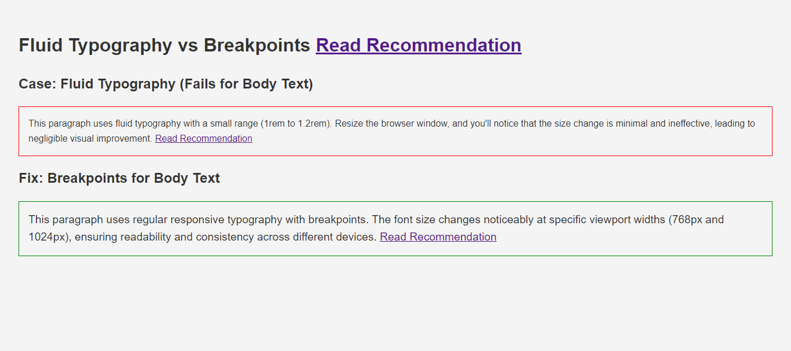
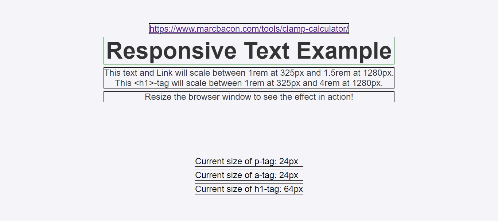
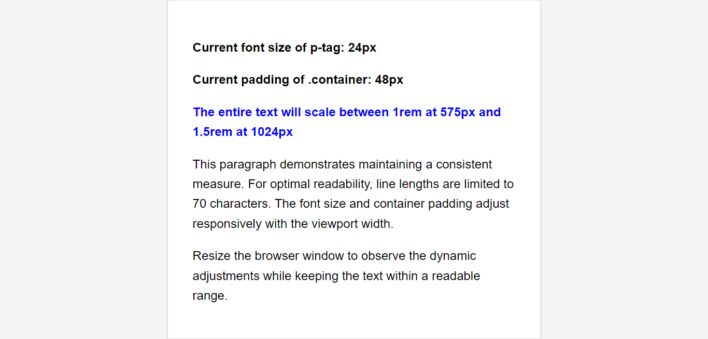
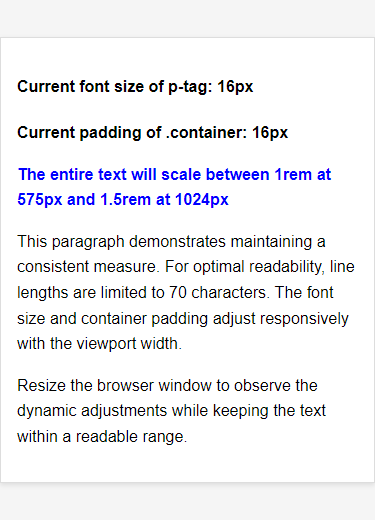
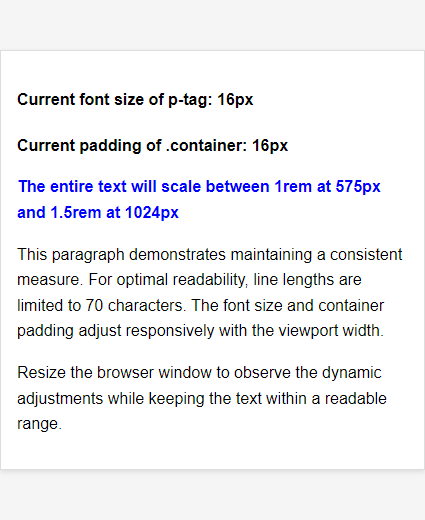

# typography-vs-breakpoints

typography vs breakpoints: when to use



### Example usage 1: Responsive text



### Example usage 2: Responsive padding and text

#### The entire text will scale between 1rem at 575px and 1.5rem at 1024px

#### Desktop devices max-width > 1024px



#### Mobile device max-width == 325px


#### Mobile Device Width == 375px



#### Mobile Device Max-Width == 425px



#### Tablet Screen Size == 768px


### Responsive togglenav-bar for mobile device

```
    <nav class="navbar navbar-expand-lg navbar-light bg-light">
      <div class="container-fluid">
        <a class="navbar-brand" href="#">Home</a>
        <button
          class="navbar-toggler"
          type="button"
          data-bs-toggle="collapse"
          data-bs-target="#navbarTogglerDemo02"
          aria-controls="navbarTogglerDemo02"
          aria-expanded="false"
          aria-label="Toggle navigation"
        >
          <svg
            xmlns="http://www.w3.org/2000/svg"
            x="0px"
            y="0px"
            width="50"
            height="50"
            viewBox="0 0 50 50"
            class="custom-navbar-toggler-icon"
          >
            <!-- Add or rewrite the attribute of fill of every path to fill="currentColor" -->
            <!-- Also you may have to change stroke attributes to stroke="currentColor" -->
            <path
              fill="currentColor"
              stroke="currentColor"
              d="M 0 9 L 0 11 L 50 11 L 50 9 Z M 0 24 L 0 26 L 50 26 L 50 24 Z M 0 39 L 0 41 L 50 41 L 50 39 Z"
            ></path>
          </svg>
        </button>

        <div class="collapse navbar-collapse" id="navbarTogglerDemo02">
          <ul class="navbar-nav me-auto mb-2 mb-lg-0">
            <li class="nav-item">
              <a class="nav-link active" aria-current="page" href="typograpgy-example-1.html"
                >Example-1</a
              >
            </li>
            <li class="nav-item">
              <a class="nav-link active" href="typograpgy-example-2.html">Example-2</a>
            </li>
          </ul>
          <form class="d-flex">
            <input
              class="form-control me-2"
              type="search"
              placeholder="Search"
              aria-label="Search"
            />
            <button class="btn btn-outline-success" type="submit">Search</button>
          </form>
        </div>
      </div>
    </nav>
```

### Add custom nav-toggler-icon added to nav-bar

#### Option-1:

```
<!-- Add or rewrite the attribute of fill of every path to fill="currentColor" -->
    <!-- Also you may have to change stroke attributes to stroke="currentColor" -->
    <path
        fill="currentColor"
        stroke="currentColor"

.custom-navbar-toggler-icon
  {
    width: 24px; /* Adjust size if needed */
    height: 24px;
    color: burlywood;
  }


```

#### Option-2 Use  for loading svg and set color in CSS3
