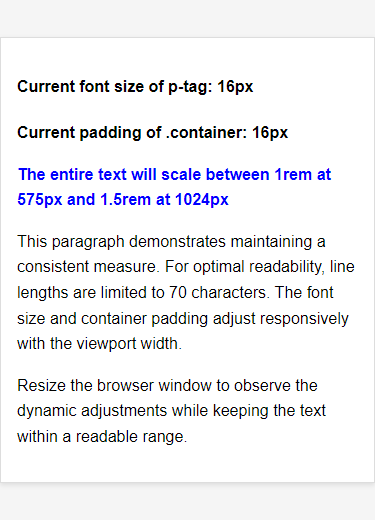
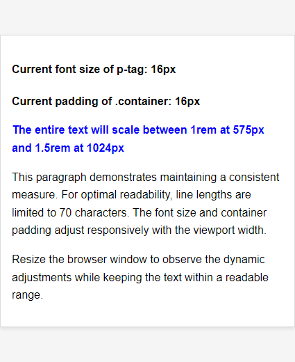
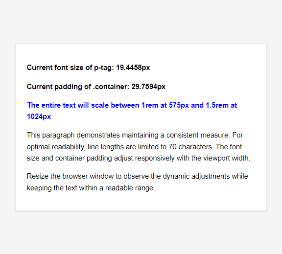

# typography-vs-breakpoints

typography vs breakpoints: when to use

### Example usage 1: Responsive text

### Example usage 2: Responsive padding and text

#### The entire text will scale between 1rem at 575px and 1.5rem at 1024px

#### Desktop devices max-width > 1024px

#### Mobile device max-width == 325px

#### Mobile Device Width == 375px

#### Mobile Device Max-Width == 425px

#### Tablet Screen Size == 768px

